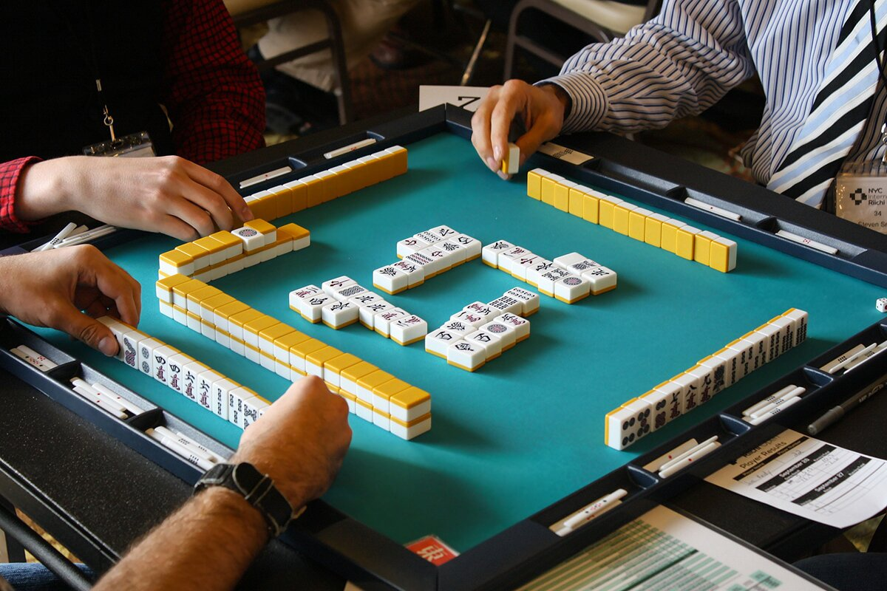
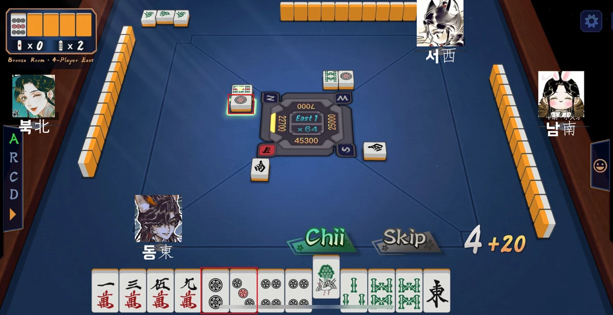
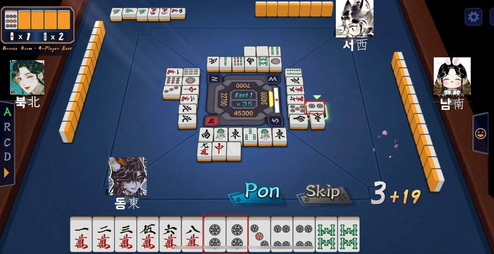

# 리치 마작 가이드

> "서서 하는 것 중 가장 재미있는 것은 골프요, 앉아서 하는 것 중 가장 재미있는 것은 마작이다."

---

## 마작이란

**"패(용) 만들기"** 게임

루미큐브 / 포커와 같이 패턴을 만들면 된다!

장풍의 경우 :

혼일색의 경우 :

> 딱봐도 후자가 좋아보임

## 2. 용을 만드는 법

마작에서는 **머리 1개, 몸통 4개**로 용을 만듭니다.
- **머리 (또이쯔)**: 같은 패 2개
  + 

- **몸통**:
  - **슌쯔**: 연속된 숫자의 패 3개
    + 
  - **커쯔**: 같은 패 3개
    + 

게임은 **패를 한 장 뽑고(쯔모), 한 장을 버리는 방식**으로 진행됩니다. "용"을 완성하기 직전의 상태를 **텐파이**라고 합니다.

하지만 이것만으로는 승리가 아니고, 용을 승천(화료)시켜야 하는데 **"역"** 이라는 조건을 만족해야 합니다.

  
1. 알맞은 개수의 머리와 몸통을 완성시킬 것
2. 역을 적어도 한 가지 이상 가지고 있을 것

을 만족해야지 승리하는 것입니다.

---

## 3. 마작패 종류

* 수패

  + 만수패 (9*4 장)
  + 

  + 통수패 (9*4 장)
  + 

  + 삭수패 (9*4 장)
  + 

* 자패

  + 풍패 (4*4 장)
  + 
  
  + 삼원패 (3*4 장)
  + 

알아두면 좋은 용어

* **중장패**: 2~8 숫자패
* **노두패**: 1,9 숫자패
* **귀족패**: 노두패 + 자패

---

## 4. 가장 쉬운 역 리치

위에서 머리 1개 / 몸통 4개를 만들어도 **"역"**을 만족해야만 승리할 수 있다고 하였는데,  
가장 쉽게 달성할 수 있는 역이 바로 **리치**입니다.

> 남의 패를 들고 오지 않는다 (이를 멘젠이라고 합니다)

이게 바로 리치의 조건.

패를 뽑고 버리는 과정을 반복하다가..  
"용"을 완성하기 직전 즉 **텐파이** 상태일 때, **리치 선언**이 가능하며
이후 플레이어는 용을 완성시킬 때 까지 패 변경이 불가능합니다.
용이 완성되면 역이 만족되어 승리할 수 있습니니다.

예시:

인 텐파이 상태에서 리치! 를 외쳤다. 하면 1삭이 들어와야 머리가 완성됨.  
리치를 외친 이후에는 플레이어는 현재 대기중인 패를 변경할 수 없으며  
타 플레이어가 1삭을 버렸을 때 "론" 을 외치거나  
본인이 1삭을 얻었을 때 "쯔모" 를 외쳐야 함

## 5. 남의 패를 어떻게 들고옴?

다른 사람의 패를 뺏어오는 것을 **울기** 라고 합니다.  
울기 이후에는 본인 자리의 우측 하단에 패를 공개하여야 합니다.

- **치**: 앞사람이 버린 패로 슌쯔를 만드는 것
  + 치 이후에는 본인 차례가 된 것으로 간주.
  + 타인의 한장이 들어왔기에 패를 버리고 턴 종료.
  + 만들어진 슌쯔는 우하단에 공개.
  + 타인의 패를 가로로 놓고 본인의 패를 세로로 놓음.
  + 

- **펑**: 같은 패가 2개있을 경우 누군가가 버린 패 1장을 가져와 같은 패 3개를 만드는 것
  + 펑 이후에는 본인 차례가가 된 것으로 간주.
  + 타인의 한장이 들어왔기에 패를 버리고 턴 종료.
  + 만들어진 커쯔는 우하단에 공개.
  + 타인의 패를 가로로 놓고 본인의 패를 세로로 놓음.
  +  

- **깡**: 같은 패가 3개있을 경우 누군가가 버린 패 1장을 가져와 같은 패 4개를 만드는 것 (몸통 취급)
  + 본인이 4장 들고 있거나 (멘젠유지), 이미 펑을 했는데 손패에 같은 패가 들어왔을 경우도 가능
  + 깡 이후에는 본인 차례가 된 것으로 간주.
  + 결과적으로 패가 한장 모자라지기에, 왕패에서 한장을 들고옴

---

## 6. 승리 방법

- **텐파이**: 한 장만 더 맞추면 승리할 수 있는 상태
- **쯔모**: 자신이 뽑은 패로 승리하는 것
- **론**: 다른 사람이 버린 패를 가져와 승리하는 것

- **후리텐**: 텐파이 상태에서 내 손패를 완성할 수 있는 패중에 단 하나라도 내가 버린적이 있으면 후리텐

예시:

1삭 or 4삭이 들어오면 이길 수 있는 상태!  
하지만 1삭을 버린 적이 있다면 이 조합으로 화료가 불가능함.

2만 or 5만 or 8만이 들어오면 이길 수 있는 상태!  
하지만 8만을 버린 적이 있다면 이 조합으로 화료가 불가능함.

---

## 6. 역 (승리 조건)

### 1판 역
- **리치**
- **멘젠쯔모**: 멘젠 상태에서 쯔모로 승리하는 것
- **일발**: 리치 후 1턴 안에 승리하는 것
- **역패**: 바람패나 삼원패로 커쯔를 모으는 것
  + 바람패는 자풍/장풍으로 모을 경우만 해당됩니다.
  + 자풍은 본인의 좌석 (동/남/서/북)
  + 장풍은 현재 게임이 진행되는 자리 (동풍전만 할 것이기에 동만 해당됩니다.)
- **탕야오**: 중장패(2~8)로만 승리하는 것
- **핑후**: 슌쯔만으로 이루어진 손패로 승리하는 것 (멘젠 필수)
- **이페코**: 같은 슌쯔 2개를 만드는 것 (멘젠 필수)
- **영상개화**: 깡을 한 후 추가로 받은 패로 승리하는 것

### 2판 역
- **또이또이**: 커쯔 4개로 승리하는 것
- **치또이츠**: 7쌍의 같은 패로 승리하는 것 (멘젠 필수)
- **삼색동순**: 서로 다른 패 종류에서 같은 숫자 슌쯔를 만드는 것 (멘젠 시 2판 / 비멘젠 시 1판)
- **삼색동각**: 서로 다른 패 종류에서 같은 숫자 커쯔를 만드는 것 (멘젠 시 2판 / 비멘젠 시 1판)

### 3-6판 역
- **혼일색**: 한 가지 숫자패 + 글자패만으로 승리 (멘젠 시 3판 / 비멘젠 시 2판)

- **청일색**: 한 종류의 숫자패만 사용해 승리 (멘젠 시 6판 / 비멘젠 시 5판)

여러 역은 조합이 가능합니다.

예시:  
리치 상태에서 쯔모로 화료했다면,  
리치에 대한 1판  
멘젠을 유지한 상태에서 쯔모했기에 1판  
총 2판의 점수를 얻습니다.

---

## 7. Quiz

화료를 위해 어떤 패가 필요한가요?

. 1.  2.  3. 

. 1.  2.  3. 

다음 중 어떤 패를 들고 있어야 를 **치**로 슌쯔를 만들 수 있나요?

. 1.  2.  3. 

다음 중 어떤 패를 들고 있어야 를 **퐁**으로 커쯔를 만들 수 있나요?

. 1.  2.  3. 

"탕야오"를 성립시키려면 어떤 패를 버려야 하나요?

||

. 1.  2.  3. 

---

## 8. 흥미가 생겼다면?

* 플레이스토어 / 앱스토어에서 작혼:리치마작 을 설치한다
* [고기먹는양의 마작강의](https://www.youtube.com/watch?v=we0N3yVOuh0&list=PL5mImhTMgpNHgR6jNJJyG00te3HGDUBzJ)
* [한권으로 읽는 리치 마작](/book.pdf)

